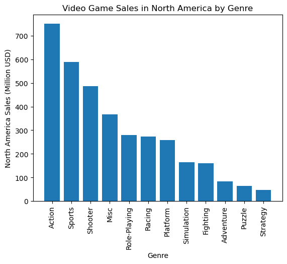
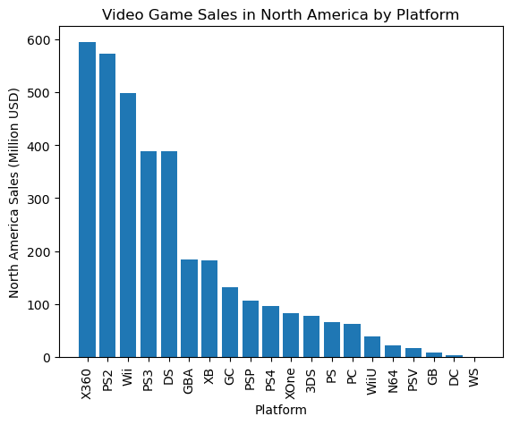
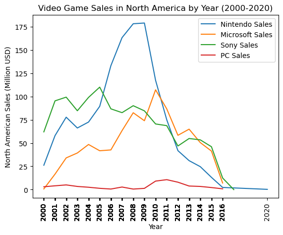
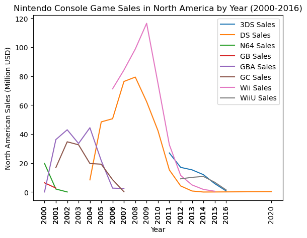
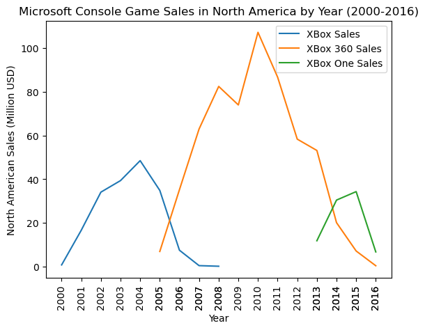
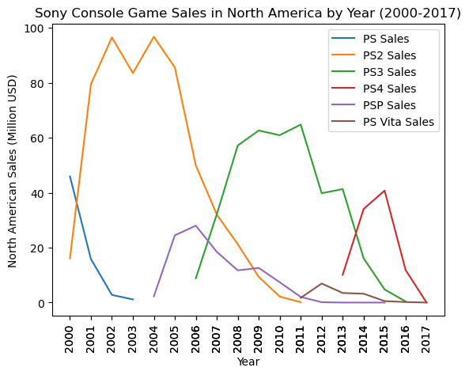
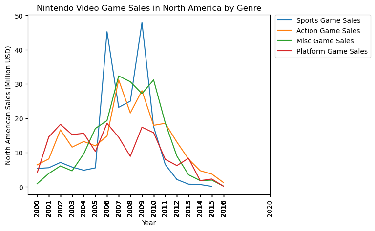
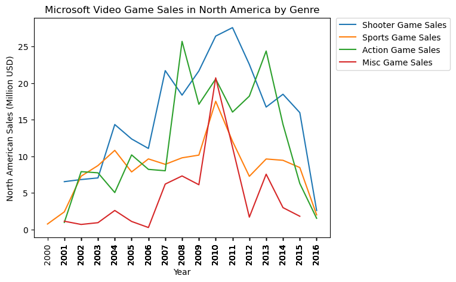
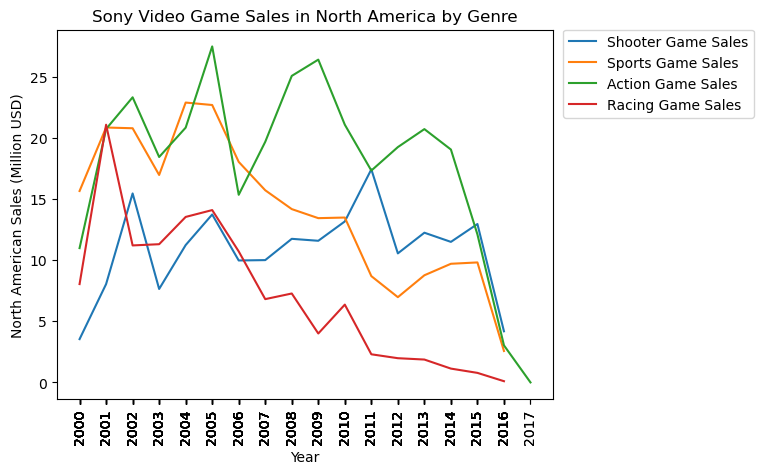

```python
import pandas as pd
import numpy as np
import matplotlib.pyplot as plt
import seaborn as sns

```

# Data Cleansing
Checking the overall structure of my data:

```python
game_sales = pd.read_csv("video_games_sales.csv")
print(game_sales.describe())
print(game_sales.info())
print(game_sales.head())
game_sales.dtypes
game_sales.isnull().sum()
```

                   rank          year      na_sales      eu_sales      jp_sales  \
    count  16598.000000  16327.000000  16598.000000  16598.000000  16598.000000   
    mean    8300.605254   2006.406443      0.264667      0.146652      0.077782   
    std     4791.853933      5.828981      0.816683      0.505351      0.309291   
    min        1.000000   1980.000000      0.000000      0.000000      0.000000   
    25%     4151.250000   2003.000000      0.000000      0.000000      0.000000   
    50%     8300.500000   2007.000000      0.080000      0.020000      0.000000   
    75%    12449.750000   2010.000000      0.240000      0.110000      0.040000   
    max    16600.000000   2020.000000     41.490000     29.020000     10.220000   
    
            other_sales  global_sales  
    count  16598.000000  16598.000000  
    mean       0.048063      0.537441  
    std        0.188588      1.555028  
    min        0.000000      0.010000  
    25%        0.000000      0.060000  
    50%        0.010000      0.170000  
    75%        0.040000      0.470000  
    max       10.570000     82.740000  
    <class 'pandas.core.frame.DataFrame'>
    RangeIndex: 16598 entries, 0 to 16597
    Data columns (total 11 columns):
     #   Column        Non-Null Count  Dtype  
    ---  ------        --------------  -----  
     0   rank          16598 non-null  int64  
     1   name          16598 non-null  object 
     2   platform      16598 non-null  object 
     3   year          16327 non-null  float64
     4   genre         16598 non-null  object 
     5   publisher     16540 non-null  object 
     6   na_sales      16598 non-null  float64
     7   eu_sales      16598 non-null  float64
     8   jp_sales      16598 non-null  float64
     9   other_sales   16598 non-null  float64
     10  global_sales  16598 non-null  float64
    dtypes: float64(6), int64(1), object(4)
    memory usage: 1.4+ MB
    None
       rank                      name platform    year         genre publisher  \
    0     1                Wii Sports      Wii  2006.0        Sports  Nintendo   
    1     2         Super Mario Bros.      NES  1985.0      Platform  Nintendo   
    2     3            Mario Kart Wii      Wii  2008.0        Racing  Nintendo   
    3     4         Wii Sports Resort      Wii  2009.0        Sports  Nintendo   
    4     5  Pokemon Red/Pokemon Blue       GB  1996.0  Role-Playing  Nintendo   
    
       na_sales  eu_sales  jp_sales  other_sales  global_sales  
    0     41.49     29.02      3.77         8.46         82.74  
    1     29.08      3.58      6.81         0.77         40.24  
    2     15.85     12.88      3.79         3.31         35.82  
    3     15.75     11.01      3.28         2.96         33.00  
    4     11.27      8.89     10.22         1.00         31.37  


    rank              0
    name              0
    platform          0
    year            271
    genre             0
    publisher        58
    na_sales          0
    eu_sales          0
    jp_sales          0
    other_sales       0
    global_sales      0
    dtype: int64


I wanted to see the range of dates covered in the data:
```python
print(game_sales['year'].min())
print(game_sales['year'].max())
```

    1980.0
    2020.0


Filtering the dates to only show sales from the year 2000 and beyond.
I added an oldtonew dataframe to have a larger sample size for a later statistical analysis:
```python
game_sales_newgen = game_sales[(game_sales['year']>=2000)]
game_sales_oldtonew = game_sales[(game_sales['year']<2020)]
print(game_sales_newgen.describe())
print(game_sales_newgen.head())
print(game_sales_newgen['year'].min())
print(game_sales_newgen['year'].max())
```

                   rank          year      na_sales      eu_sales      jp_sales  \
    count  14353.000000  14353.000000  14353.000000  14353.000000  14353.000000   
    mean    8537.008012   2007.944054      0.245361      0.145966      0.056398   
    std     4787.545431      4.049582      0.716572      0.515532      0.249819   
    min        1.000000   2000.000000      0.000000      0.000000      0.000000   
    25%     4405.000000   2005.000000      0.000000      0.000000      0.000000   
    50%     8631.000000   2008.000000      0.080000      0.020000      0.000000   
    75%    12710.000000   2011.000000      0.230000      0.110000      0.030000   
    max    16600.000000   2020.000000     41.490000     29.020000      6.500000   
    
            other_sales  global_sales  
    count  14353.000000  14353.000000  
    mean       0.051171      0.499190  
    std        0.200431      1.471345  
    min        0.000000      0.010000  
    25%        0.000000      0.060000  
    50%        0.010000      0.160000  
    75%        0.040000      0.450000  
    max       10.570000     82.740000  
       rank                   name platform    year     genre publisher  na_sales  \
    0     1             Wii Sports      Wii  2006.0    Sports  Nintendo     41.49   
    2     3         Mario Kart Wii      Wii  2008.0    Racing  Nintendo     15.85   
    3     4      Wii Sports Resort      Wii  2009.0    Sports  Nintendo     15.75   
    6     7  New Super Mario Bros.       DS  2006.0  Platform  Nintendo     11.38   
    7     8               Wii Play      Wii  2006.0      Misc  Nintendo     14.03   
    
       eu_sales  jp_sales  other_sales  global_sales  
    0     29.02      3.77         8.46         82.74  
    2     12.88      3.79         3.31         35.82  
    3     11.01      3.28         2.96         33.00  
    6      9.23      6.50         2.90         30.01  
    7      9.20      2.93         2.85         29.02  
    2000.0
    2020.0


This helps me filter out some datasets to better get a sense of the data:
```python
newgen_genre = game_sales_newgen[['year', 'genre', 'na_sales', 'eu_sales', 'jp_sales', 'other_sales', 'global_sales']]
newgen_platform = game_sales_newgen[['platform', 'year', 'na_sales', 'eu_sales', 'jp_sales', 'other_sales', 'global_sales' ]]
newgen_publisher = game_sales_newgen[['year', 'publisher', 'na_sales', 'eu_sales', 'jp_sales', 'other_sales', 'global_sales']]
```

I wanted to make a dataset of the total North American sales by year and platform to see the general trends:
```python
newgen_nasum = game_sales_newgen.groupby(['year', 'platform', 'genre'])['na_sales'].sum()
newgen_nasum_reset = newgen_nasum.reset_index()
newgen_sorted = newgen_nasum_reset.sort_values(['na_sales', 'platform'], ascending=False)
print(newgen_sorted.head(15))

oldtonew_nasum = game_sales_oldtonew.groupby(['year', 'platform', 'genre'])['na_sales'].sum()
oldtonew_nasum_reset = oldtonew_nasum.reset_index()
print(newgen_nasum_reset)
print(oldtonew_nasum_reset)
```

            year platform    genre  na_sales
    761   2009.0      Wii   Sports     45.42
    499   2006.0      Wii   Sports     42.60
    941   2011.0     X360  Shooter     27.59
    848   2010.0     X360  Shooter     26.43
    681   2008.0     X360   Action     25.71
    832   2010.0      Wii     Misc     25.26
    374   2005.0      PS2   Action     23.00
    1025  2012.0     X360  Shooter     22.56
    176   2002.0      PS2   Action     22.40
    309   2004.0      PS2   Sports     22.38
    604   2007.0     X360  Shooter     21.71
    771   2009.0     X360  Shooter     21.67
    727   2009.0      PS3   Action     21.03
    186   2002.0      PS2   Sports     20.75
    844   2010.0     X360     Misc     20.72
            year platform         genre  na_sales
    0     2000.0       DC        Action      0.41
    1     2000.0       DC     Adventure      0.00
    2     2000.0       DC      Fighting      0.00
    3     2000.0       DC        Racing      1.10
    4     2000.0       DC  Role-Playing      0.00
    ...      ...      ...           ...       ...
    1353  2016.0     XOne      Strategy      0.01
    1354  2017.0      PS4  Role-Playing      0.00
    1355  2017.0      PSV        Action      0.00
    1356  2017.0      PSV  Role-Playing      0.00
    1357  2020.0       DS    Simulation      0.27
    
    [1358 rows x 4 columns]
            year platform         genre  na_sales
    0     1980.0     2600        Action      0.32
    1     1980.0     2600      Fighting      0.72
    2     1980.0     2600          Misc      2.53
    3     1980.0     2600       Shooter      6.56
    4     1980.0     2600        Sports      0.46
    ...      ...      ...           ...       ...
    1798  2016.0     XOne        Sports      1.86
    1799  2016.0     XOne      Strategy      0.01
    1800  2017.0      PS4  Role-Playing      0.00
    1801  2017.0      PSV        Action      0.00
    1802  2017.0      PSV  Role-Playing      0.00
    
    [1803 rows x 4 columns]


Now I want to separate by the main home gaming systems, including the PC, found in North America from 2000-2010:
```python
newgen_nintendo = newgen_nasum_reset[newgen_nasum_reset['platform'].isin(["N64", "GB", "GBA", "GC", "DS", "3DS", "Wii", "WiiU"])]
newgen_microsoft = newgen_nasum_reset[newgen_nasum_reset['platform'].isin(["XOne", "XB", "X360"])]
newgen_sony = newgen_nasum_reset[newgen_nasum_reset['platform'].isin(["PS", "PS2", "PS3", "PS4", "PSP", "PSV"])]
newgen_PC = newgen_nasum_reset[newgen_nasum_reset['platform'].isin(["PC"])]

oldtonew_nintendo = oldtonew_nasum_reset[oldtonew_nasum_reset['platform'].isin(["SNES","NES","N64", "GB", "GBA", "GC", "DS", "3DS", "Wii", "WiiU"])]

print(newgen_nintendo.head())
print(newgen_microsoft.head())
print(newgen_sony.head())
print(newgen_PC.head())
print(oldtonew_nintendo.head())
```

          year platform      genre  na_sales
    7   2000.0       GB     Action      0.00
    8   2000.0       GB  Adventure      0.00
    9   2000.0       GB       Misc      0.00
    10  2000.0       GB   Platform      2.15
    11  2000.0       GB     Puzzle      0.29
           year platform     genre  na_sales
    57   2000.0       XB    Sports      0.74
    128  2001.0       XB    Action      0.96
    129  2001.0       XB  Fighting      1.19
    130  2001.0       XB      Misc      1.12
    131  2001.0       XB  Platform      0.79
          year platform      genre  na_sales
    31  2000.0       PS     Action     10.12
    32  2000.0       PS  Adventure      1.01
    33  2000.0       PS   Fighting      5.08
    34  2000.0       PS       Misc      4.54
    35  2000.0       PS   Platform      3.61
          year platform         genre  na_sales
    27  2000.0       PC          Misc      1.67
    28  2000.0       PC  Role-Playing      0.01
    29  2000.0       PC    Simulation      0.01
    30  2000.0       PC      Strategy      1.34
    97  2001.0       PC        Action      0.01
          year platform     genre  na_sales
    24  1983.0      NES      Misc      0.01
    25  1983.0      NES  Platform      1.58
    26  1983.0      NES    Sports      0.73
    28  1984.0      NES    Action      0.80
    29  1984.0      NES      Misc      0.00


# Insights


```python
fig, ax = plt.subplots()
newgen_genre_agg = newgen_sorted.groupby('genre')['na_sales'].sum()
newgen_genre_reset = newgen_genre_agg.reset_index()
newgen_genre_sorted = newgen_genre_reset.sort_values('na_sales', ascending=False)
plt.bar(newgen_genre_sorted['genre'], newgen_genre_sorted['na_sales'])
plt.xticks(newgen_genre_sorted['genre'], rotation=90)
plt.ylabel('North America Sales (Million USD)')
plt.xlabel('Genre')
plt.title('Video Game Sales in North America by Genre')
plt.show()
```


We can see that the Action genre had by far the strongest sales numbers in North America.<br>
Sports, Shooters, and Misc. games have also had great numbers so far from 2000-2020.<br>    

    


```python
fig, ax = plt.subplots()
newgen_plat_agg = newgen_sorted.groupby('platform')['na_sales'].sum()
newgen_plat_reset = newgen_plat_agg.reset_index()
newgen_plat_sorted = newgen_plat_reset.sort_values('na_sales', ascending=False)
plt.bar(newgen_plat_sorted['platform'], newgen_plat_sorted['na_sales'])
plt.xticks(newgen_plat_sorted['platform'], rotation=90)
plt.ylabel('North America Sales (Million USD)')
plt.xlabel('Platform')
plt.title('Video Game Sales in North America by Platform')
plt.show()

```


It seems the XBox 360 had the most sales the past two decades, followed by the PS2 and the Wii.    

    


Aggregated all the different systems into their umbrella companies to see overall sales trends by major company:
```python
fig, ax = plt.subplots()
newgen_nintendo_group = newgen_nintendo.groupby("year")["na_sales"].sum()
newgen_nintendo_group.plot(x='year', y='na_sales', kind='line', label='Nintendo Sales')

newgen_microsoft_group = newgen_microsoft.groupby("year")["na_sales"].sum()
newgen_microsoft_group.plot(x='year', y='na_sales', kind='line', label='Microsoft Sales')

newgen_sony_group = newgen_sony.groupby("year")["na_sales"].sum()
newgen_sony_group.plot(x='year', y='na_sales', kind='line', label='Sony Sales')

newgen_PC_group = newgen_PC.groupby("year")["na_sales"].sum()
newgen_PC_group.plot(x='year', y='na_sales', kind='line', label='PC Sales')

plt.xticks(newgen_nintendo['year'], rotation=90)
plt.legend()
plt.ylabel('North American Sales (Million USD)')
plt.xlabel('Year')
plt.title('Video Game Sales in North America by Year (2000-2020)')
plt.show()

```


Nintendo has the best historic sales from 2005-2011.
Nevertheless, it seems that with the advent of next generation consoles in 2010, Microsoft and Sony have steadily 
overtaken Nintendo in sales over the past decade.
PC sales have not been as large when compared to the home consoles.    

    


# Nintendo Console Sales


```python
nintendo_system_sales = newgen_nintendo.groupby(["platform", "year"])["na_sales"].sum()
nintendo_consoles = nintendo_system_sales.reset_index()

ds3_sales = nintendo_consoles[nintendo_consoles['platform'].isin(['3DS'])]
ds3_group = ds3_sales.groupby("year")["na_sales"].sum()

ds_sales = nintendo_consoles[nintendo_consoles['platform'].isin(['DS'])]
ds_group = ds_sales.groupby("year")["na_sales"].sum()

n64_sales = nintendo_consoles[nintendo_consoles['platform'].isin(['N64'])]
n64_group = n64_sales.groupby("year")["na_sales"].sum()

gb_sales = nintendo_consoles[nintendo_consoles['platform'].isin(['GB'])]
gb_group = gb_sales.groupby("year")["na_sales"].sum()

gba_sales = nintendo_consoles[nintendo_consoles['platform'].isin(['GBA'])]
gba_group = gba_sales.groupby("year")["na_sales"].sum()

gc_sales = nintendo_consoles[nintendo_consoles['platform'].isin(['GC'])]
gc_group = gc_sales.groupby("year")["na_sales"].sum()

wii_sales = nintendo_consoles[nintendo_consoles['platform'].isin(['Wii'])]
wii_group = wii_sales.groupby("year")["na_sales"].sum()

wiiu_sales = nintendo_consoles[nintendo_consoles['platform'].isin(['WiiU'])]
wiiu_group = wiiu_sales.groupby("year")["na_sales"].sum()

ds3_group.plot(x='year', y='na_sales', kind='line', label='3DS Sales')
ds_group.plot(x='year', y='na_sales', kind='line', label='DS Sales')
n64_group.plot(x='year', y='na_sales', kind='line', label='N64 Sales')
gb_group.plot(x='year', y='na_sales', kind='line', label='GB Sales')
gba_group.plot(x='year', y='na_sales', kind='line', label='GBA Sales')
gc_group.plot(x='year', y='na_sales', kind='line', label='GC Sales')
wii_group.plot(x='year', y='na_sales', kind='line', label='Wii Sales')
wiiu_group.plot(x='year', y='na_sales', kind='line', label='WiiU Sales')
plt.legend()
plt.xticks(nintendo_consoles['year'], rotation=90)
plt.ylabel('North American Sales (Million USD)')
plt.xlabel('Year')
plt.title('Nintendo Console Game Sales in North America by Year (2000-2016)')
plt.show()

```


The Wii and DS were by far Nintendo's most successful systems in terms of overall sales in North America from 2004-2012.    

    


# Microsoft Console Sales


```python
microsoft_system_sales = newgen_microsoft.groupby(["platform", "year"])["na_sales"].sum()
microsoft_consoles = microsoft_system_sales.reset_index()

xb_sales = microsoft_consoles[microsoft_consoles['platform'].isin(['XB'])]
xb_group = xb_sales.groupby("year")["na_sales"].sum()

x360_sales = microsoft_consoles[microsoft_consoles['platform'].isin(['X360'])]
x360_group = x360_sales.groupby("year")["na_sales"].sum()

xone_sales = microsoft_consoles[microsoft_consoles['platform'].isin(['XOne'])]
xone_group = xone_sales.groupby("year")["na_sales"].sum()

xb_group.plot(x='year', y='na_sales', kind='line', label='XBox Sales')
x360_group.plot(x='year', y='na_sales', kind='line', label='XBox 360 Sales')
xone_group.plot(x='year', y='na_sales', kind='line', label='XBox One Sales')
plt.legend()
plt.xticks(microsoft_consoles['year'], rotation=90)
plt.ylabel('North American Sales (Million USD)')
plt.xlabel('Year')
plt.title('Microsoft Console Game Sales in North America by Year (2000-2016)')
plt.show()

```


We can see that the XBox 360 had the best sales numbers for Microsoft from 2006-2014.    

    


# Sony Console Sales


```python
sony_system_sales = newgen_sony.groupby(["platform", "year"])["na_sales"].sum()
sony_consoles = sony_system_sales.reset_index()

ps_sales = sony_consoles[sony_consoles['platform'].isin(['PS'])]
ps_group = ps_sales.groupby("year")["na_sales"].sum()

ps2_sales = sony_consoles[sony_consoles['platform'].isin(['PS2'])]
ps2_group = ps2_sales.groupby("year")["na_sales"].sum()

ps3_sales = sony_consoles[sony_consoles['platform'].isin(['PS3'])]
ps3_group = ps3_sales.groupby("year")["na_sales"].sum()

ps4_sales = sony_consoles[sony_consoles['platform'].isin(['PS4'])]
ps4_group = ps4_sales.groupby("year")["na_sales"].sum()

psp_sales = sony_consoles[sony_consoles['platform'].isin(['PSP'])]
psp_group = psp_sales.groupby("year")["na_sales"].sum()

psv_sales = sony_consoles[sony_consoles['platform'].isin(['PSV'])]
psv_group = psv_sales.groupby("year")["na_sales"].sum()

ps_group.plot(x='year', y='na_sales', kind='line', label='PS Sales')
ps2_group.plot(x='year', y='na_sales', kind='line', label='PS2 Sales')
ps3_group.plot(x='year', y='na_sales', kind='line', label='PS3 Sales')
ps4_group.plot(x='year', y='na_sales', kind='line', label='PS4 Sales')
psp_group.plot(x='year', y='na_sales', kind='line', label='PSP Sales')
psv_group.plot(x='year', y='na_sales', kind='line', label='PS Vita Sales')

plt.legend()
plt.xticks(sony_consoles['year'], rotation=90)
plt.ylabel('North American Sales (Million USD)')
plt.xlabel('Year')
plt.title('Sony Console Game Sales in North America by Year (2000-2017)')
plt.show()

```


The PS2, followed by the PS3, were Sony's most successful consoles to date (2001-2007 & 2007-2014 respectively).    

    


# Sales by Genre for Nintendo


```python
nintendo_genre_sales = newgen_nintendo.groupby(["genre", "year"])["na_sales"].sum()
nintendo_genre = nintendo_genre_sales.reset_index()
nintendo_genre_sorted = nintendo_genre.sort_values(["na_sales", "genre"], ascending=False)
nintendo_genre_top20 = nintendo_genre_sorted.iloc[:20]
print(nintendo_genre_top20)
# Wanted to see the top 20 overall sales genres and their corresponding years

nintendo_sports = nintendo_genre[nintendo_genre['genre'].isin(["Sports"])]
nintendo_sports_group = nintendo_sports.groupby("year")["na_sales"].sum()

nintendo_action = nintendo_genre[nintendo_genre['genre'].isin(["Action"])]
nintendo_action_group = nintendo_action.groupby("year")["na_sales"].sum()

nintendo_misc = nintendo_genre[nintendo_genre['genre'].isin(["Misc"])]
nintendo_misc_group = nintendo_misc.groupby("year")["na_sales"].sum()

nintendo_platform = nintendo_genre[nintendo_genre['genre'].isin(["Platform"])]
nintendo_platform_group = nintendo_platform.groupby("year")["na_sales"].sum()

nintendo_simulation = nintendo_genre[nintendo_genre['genre'].isin(["Simulation"])]
nintendo_racing = nintendo_genre[nintendo_genre['genre'].isin(["Racing"])]
nintendo_action = nintendo_genre[nintendo_genre['genre'].isin(["Action"])]


nintendo_sports_group.plot(x='year', y='na_sales', kind='line', label="Sports Game Sales")
nintendo_action_group.plot(x='year', y='na_sales', kind='line', label="Action Game Sales")
nintendo_misc_group.plot(x='year', y='na_sales', kind='line', label="Misc Game Sales")
nintendo_platform_group.plot(x='year', y='na_sales', kind='line', label="Platform Game Sales")
plt.legend(bbox_to_anchor=(1.02, 1), loc='upper left', borderaxespad=0)
plt.xticks(nintendo_genre['year'], rotation=90)
plt.ylabel('North American Sales (Million USD)')
plt.xlabel('Year')
plt.title('Nintendo Video Game Sales in North America by Genre')
plt.show()
```

              genre    year  na_sales
    177      Sports  2009.0     47.87
    174      Sports  2006.0     45.24
    58         Misc  2007.0     32.33
    7        Action  2007.0     31.19
    61         Misc  2010.0     31.17
    59         Misc  2008.0     30.64
    9        Action  2009.0     28.03
    60         Misc  2009.0     27.18
    158  Simulation  2008.0     25.44
    176      Sports  2008.0     24.96
    175      Sports  2007.0     23.18
    157  Simulation  2007.0     22.95
    8        Action  2008.0     21.53
    109      Racing  2008.0     20.76
    57         Misc  2006.0     19.31
    62         Misc  2011.0     18.65
    74     Platform  2006.0     18.51
    11       Action  2011.0     18.51
    70     Platform  2002.0     18.22
    10       Action  2010.0     17.93


    

    


### We can see in the graph above that the majority of sales for Nintendo were driven by Sports, Action, and Misc. games. Furthermore, the large spikes in the Sports game sales in 2006 and 2009 correspond with a boom in sales for the Wii system.

# Sales by Genre for Microsoft

Wanted to see the top 20 overall sales genres and their corresponding years:
```python
microsoft_genre_sales = newgen_microsoft.groupby(["genre", "year"])["na_sales"].sum()
microsoft_genre = microsoft_genre_sales.reset_index()
microsoft_genre_sorted = microsoft_genre.sort_values(["na_sales", "genre"], ascending=False)
microsoft_genre_top20 = microsoft_genre_sorted.iloc[:20]
print(microsoft_genre_top20)

microsoft_shooter = microsoft_genre[microsoft_genre['genre'].isin(["Shooter"])]
microsoft_shooter_group = microsoft_shooter.groupby("year")["na_sales"].sum()

microsoft_sports = microsoft_genre[microsoft_genre['genre'].isin(["Sports"])]
microsoft_sports_group = microsoft_sports.groupby("year")["na_sales"].sum()

microsoft_action = microsoft_genre[microsoft_genre['genre'].isin(["Action"])]
microsoft_action_group = microsoft_action.groupby("year")["na_sales"].sum()

microsoft_misc = microsoft_genre[microsoft_genre['genre'].isin(["Misc"])]
microsoft_misc_group = microsoft_misc.groupby("year")["na_sales"].sum()

microsoft_shooter_group.plot(x='year', y='na_sales', kind='line', label="Shooter Game Sales")
microsoft_sports_group.plot(x='year', y='na_sales', kind='line', label="Sports Game Sales")
microsoft_action_group.plot(x='year', y='na_sales', kind='line', label="Action Game Sales")
microsoft_misc_group.plot(x='year', y='na_sales', kind='line', label="Misc Game Sales")
plt.legend(bbox_to_anchor=(1.02, 1), loc='upper left', borderaxespad=0)
plt.xticks(microsoft_genre['year'], rotation=90)
plt.ylabel('North American Sales (Million USD)')
plt.xlabel('Year')
plt.title('Microsoft Video Game Sales in North America by Genre')
plt.show()
```

           genre    year  na_sales
    124  Shooter  2011.0     27.59
    123  Shooter  2010.0     26.43
    7     Action  2008.0     25.71
    12    Action  2013.0     24.39
    125  Shooter  2012.0     22.56
    120  Shooter  2007.0     21.71
    122  Shooter  2009.0     21.67
    56      Misc  2010.0     20.72
    9     Action  2010.0     20.57
    127  Shooter  2014.0     18.48
    121  Shooter  2008.0     18.36
    11    Action  2012.0     18.22
    156   Sports  2010.0     17.52
    8     Action  2009.0     17.11
    126  Shooter  2013.0     16.73
    10    Action  2011.0     16.04
    128  Shooter  2015.0     15.97
    13    Action  2014.0     14.36
    117  Shooter  2004.0     14.34
    118  Shooter  2005.0     12.37


    

    


### Shooting and Action games seem to be the major sellers for Microsoft home consoles. The spikes in 2008 for action games and 2011 for shooting games correspond with major spikes in XBox 360 game sales.

# Sales by Genre for Sony


Wanted to see the top 20 overall sales genres and their corresponding years:
```python
sony_genre_sales = newgen_sony.groupby(["genre", "year"])["na_sales"].sum()
sony_genre = sony_genre_sales.reset_index()
sony_genre_sorted = sony_genre.sort_values(["na_sales", "genre"], ascending=False)
sony_genre_top20 = sony_genre_sorted.iloc[:20]
print(sony_genre_top20)

sony_shooter = sony_genre[sony_genre['genre'].isin(["Shooter"])]
sony_shooter_group = sony_shooter.groupby("year")["na_sales"].sum()

sony_sports = sony_genre[sony_genre['genre'].isin(["Sports"])]
sony_sports_group = sony_sports.groupby("year")["na_sales"].sum()

sony_action = sony_genre[sony_genre['genre'].isin(["Action"])]
sony_action_group = sony_action.groupby("year")["na_sales"].sum()

sony_racing = sony_genre[sony_genre['genre'].isin(["Racing"])]
sony_racing_group = sony_racing.groupby("year")["na_sales"].sum()

sony_shooter_group.plot(x='year', y='na_sales', kind='line', label="Shooter Game Sales")
sony_sports_group.plot(x='year', y='na_sales', kind='line', label="Sports Game Sales")
sony_action_group.plot(x='year', y='na_sales', kind='line', label="Action Game Sales")
sony_racing_group.plot(x='year', y='na_sales', kind='line', label="Racing Game Sales")
plt.legend(bbox_to_anchor=(1.02, 1), loc='upper left', borderaxespad=0)
plt.xticks(sony_genre['year'], rotation=90)
plt.ylabel('North American Sales (Million USD)')
plt.xlabel('Year')
plt.title('Sony Video Game Sales in North America by Genre')
plt.show()
```

           genre    year  na_sales
    5     Action  2005.0     27.47
    9     Action  2009.0     26.39
    8     Action  2008.0     25.06
    2     Action  2002.0     23.31
    173   Sports  2004.0     22.88
    174   Sports  2005.0     22.68
    101   Racing  2001.0     21.07
    10    Action  2010.0     21.07
    170   Sports  2001.0     20.84
    4     Action  2004.0     20.83
    171   Sports  2002.0     20.78
    1     Action  2001.0     20.72
    13    Action  2013.0     20.71
    7     Action  2007.0     19.67
    12    Action  2012.0     19.24
    14    Action  2014.0     19.04
    3     Action  2003.0     18.43
    175   Sports  2006.0     18.03
    146  Shooter  2011.0     17.42
    11    Action  2011.0     17.32


    

    


### Sony sales seem to be dominated by Action and Sports games, with Shooters gaining popularity from 2010 onward. The peaks of action game sales in 2005 and 2009 correspond with peak game sales in the PS2 and PS3 consoles, respectively. The peak of shooter game sales in 2011, along a high level of action game sales in the same year, seems to correspond with a peak in PS3 sales of that same year.


```python
from scipy import stats

oldtonew_nintendo_group = oldtonew_nintendo.groupby("year")["na_sales"].sum()
nintendo_genre_old = oldtonew_nintendo.groupby(["genre", "year"])["na_sales"].sum()
oldtonew_nintendo_genre = nintendo_genre_old.reset_index()

oldtonew_nintendo_sports = oldtonew_nintendo_genre[oldtonew_nintendo_genre['genre'].isin(["Sports"])]
total_nintendo_sports_group = oldtonew_nintendo_sports.groupby("year")["na_sales"].sum()

oldtonew_nintendo_action = oldtonew_nintendo_genre[oldtonew_nintendo_genre['genre'].isin(["Action"])]
total_nintendo_action_group = oldtonew_nintendo_action.groupby("year")["na_sales"].sum()

oldtonew_nintendo_misc = oldtonew_nintendo_genre[oldtonew_nintendo_genre['genre'].isin(["Misc"])]
total_nintendo_misc_group = oldtonew_nintendo_misc.groupby("year")["na_sales"].sum()

oldtonew_nintendo_platform = oldtonew_nintendo_genre[oldtonew_nintendo_genre['genre'].isin(["Platform"])]
total_nintendo_platform_group = oldtonew_nintendo_platform.groupby("year")["na_sales"].sum()

oldtonew_nintendo_clean = oldtonew_nintendo_group[oldtonew_nintendo_group.index<=2015]
oldtonew_nintendo_clean2 = oldtonew_nintendo_group[oldtonew_nintendo_group.index<=2016]
oldtonew_nintendo_clean3 = oldtonew_nintendo_group[(oldtonew_nintendo_group.index>=1984) & (oldtonew_nintendo_group.index!=1987) & (oldtonew_nintendo_group.index<=2016)]
# Cleaned the total Nintendo sales grouped dataframe to have the same amount of data as the diff genre dataframes

print(oldtonew_nintendo_clean.count())
print(oldtonew_nintendo_clean2.count())
print(oldtonew_nintendo_clean3.count())
print(total_nintendo_sports_group.count())
print(total_nintendo_action_group.count())
print(total_nintendo_platform_group.count())

# Calculated Pearsons r coefficient to determine correlation
corr, _ = pearsonr(oldtonew_nintendo_clean, total_nintendo_sports_group)
print('Pearsons correlation for Sports genre and total Nintendo Sales (1983-2015): %.3f' % corr)

corr2, _ = pearsonr(oldtonew_nintendo_clean3, total_nintendo_action_group)
print('Pearsons correlation for Action genre and total Nintendo Sales (1984-2016): %.3f' % corr2)

corr3, _ = pearsonr(oldtonew_nintendo_clean2, total_nintendo_platform_group)
print('Pearsons correlation for Platform genre and total Nintendo Sales (1983-2016): %.3f' % corr3)
```

    33
    34
    32
    33
    32
    34
    Pearsons correlation for Sports genre and total Nintendo Sales: 0.867
    Pearsons correlation for Action genre and total Nintendo Sales: 0.907
    Pearsons correlation for Platform genre and total Nintendo Sales: 0.496


### Although the sample sizes are in the low 30s, I wanted to perform a Pearson's correlation analysis to determine the relationship between total North American Nintendo sales (from the 1980s to modern times) and the 3 most popular genres: Sports, Action, and Platform games. I excluded the Misc. genre as there are too many gaps in the data for this genre.
### The strongest positive correlation is between Action games and sales with an r-value of 0.907.
### This is followed a strong positive correlation between Sports games and sales with an r-vale of 0.867.
